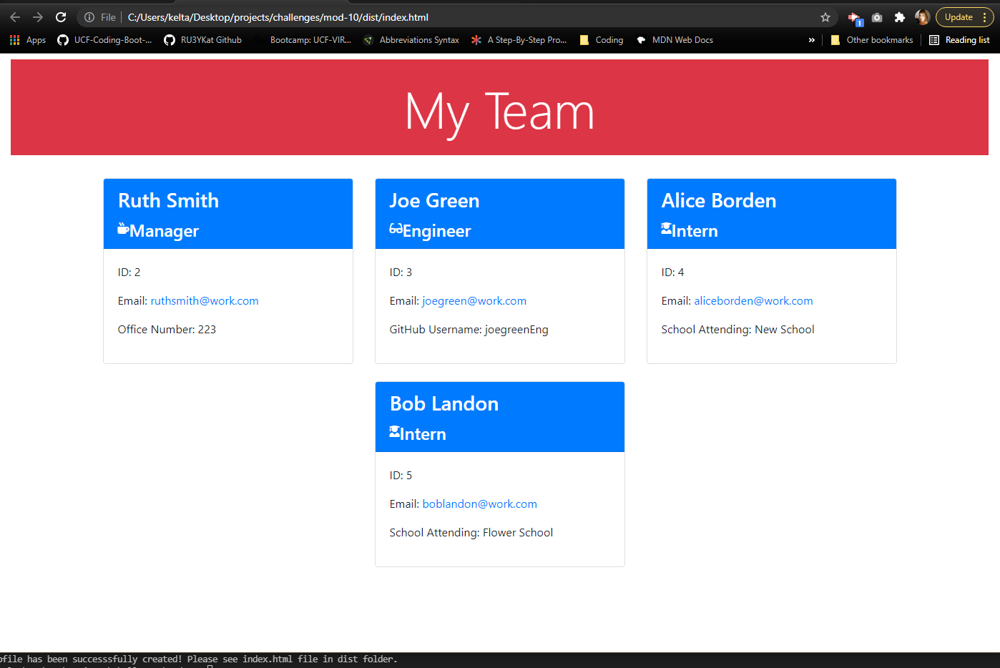

# team profile generator

[team-profile-generator](https://github.com/RU3YKat/team-profile-generator)

## Description

The Team Profile Generator is a Node.js based application that accepts user input via CLI to produce a custom html of your team.

## Table of Contents

- [Installation Instructions](#installation)
- [Usage Information](#usage)
- [License](#license)
- [Contribution Guidelines](#contributing)
- [Test Instructions](#testing)
- [Questions?](#questions?)

## Installation

To create your Team Profile, clone this repository to your local computer.  
This program requires [Node.js](https://nodejs.org/en/) and [Inquirer NPM](https://www.npmjs.com/package/inquirer), which can be installed using [node.js Package Manager](https://www.npmjs.com/). To make use of testing, install [Jest](https://jestjs.io/).
Install the above, then use your CLI (command-line-interface) to run:

> npm init  
> npm install inquirer

Run the Team Profile Generator by executing `node index` from the command line.

Find your team profile HTML in the /dist folder.

## Usage

[walkthrough video on Google Drive](https://drive.google.com/file/d/1QBMDOOwvdeWqhMeamqlBs3cUtIAlU_G_/view?usp=drivesdk)

Please download the [complete Walkthrough Video here](images/team-profile_best-walkthrough.mp4).

Screenshot of end product team profile HTML.

## License

This project was created using MIT license.

## Contributing

This is an open source project.

## Testing

To test the program, please install [Jest](https://jestjs.io/) and execute `npm run test <name to test>` from the command line.

## Questions?

This program was created by [ru3ykat on GitHub](https://github.com/RU3YKat).

Contact me at [ru3ykat on Gmail](ru3ykat@gmail.com).
